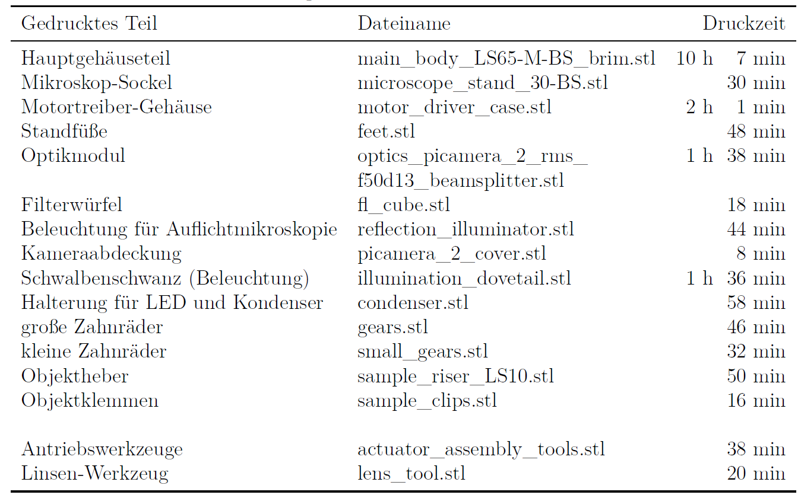

# Verwendete Materialien 

## Gedruckte Mikroskop- und Zubehörteile

Alle Teile werden auf einem *Prusa i3 MK3S* 3D-Drucker gedruckt. Als Filament wird *Prusament PLA* in *Galaxy Silver* und *Vanilla White* verwendet.
Im Prusa-Slicer wurden folgende Druck-Parameter eingestellt:
* Schichtdicke: 0,2 mm (SPEED)
* Infill: 20\%
* Stützen: Keine (alle Teile sind so konstruiert, dass keine Stützstrukturen notwendig sind)

    

    
    <em> 3D-gedruckte Teile und ihre Druckzeiten</em>
    

## Elektronische Bauteile

Nachfolgend !!! (noch einfügen) befindet sich eine vollständige Kostenübersicht der verwendeten, nicht druckbaren Bauteile. Bei den unter [Sonstige Kleinteile](sonstige-kleinteile) aufgeführten Positionen (insbesondere den O-Ringen) empfiehlt es sich, einige Teile in Reserve zu haben und je nach Bedarf z. B. mit unterschiedlichen Schraubenlängen zu experimentieren.

* LED (weiß, *Nichia 500D*)
    * Durchmesser: 5 mm
    * Sockel: T-1 3/4
    * Spannung: 3,2 V
    * Betrachtungswinkel: 15°
    * Lichtstärke: 10 cd

* LED (grün, 525 nm, *LuminousLED ultrahell*)
    * Durchmesser: 5 mm
    * Sockel: T-1 3/4
    * Spannung: 3,0 - 3,4 V
    * Betrachtungswinkel: 15°
    * Lichtstärke: 22 cd

* Ohmsche Widerstände
    * 2x 60 Ohm Festwiderstände
    * Potentiometer mit bis zu 10 kOhm

* Raspberry Pi 4 Model B + Kameramodul
    * Arbeitsspeicher (RAM): 2 GB
    * Prozessor: ARM Cortex-A72 (4x1,5 GHz)
    * Anschlüsse:
      * Ethernet/LAN (10/100/1000 Mbit)
      * 2x USB 2.0
      * 2x USB 3.0
      * 2x HDMI
      * microSD
      * 3,5 mm-Klinke
      * USB-C ($\to$ Stromversorgung)
      * Ausgangsspannung: 5 V
      * Ausgangsstrom: 3 A

* Mikroschritt-Motoren *28BYJ-48* + Treiberplatinen
    * Getriebeübersetzung: 1/64
    * Schrittwinkel: 5625 * 1/64

* Mikrocontroller *Arduino nano*
    * Arbeitsspeicher (RAM): 2 GB
    * EPROM: 1 KB
    * Taktrate: 16 MHz

* USB-C-Buchse

## Optische Teile

* Achromatische Linse (*Thorlabs AC127-050-A*)
    * Plankonvex
    * Material: N-BAK4/SF5
    * Brennweite: *f* = 50 mm
    * Lichtbereich: 400 - 700 nm
    * Durchmesser: 12,7 mm (0,5")

* Kunststoff-Kondenserlinse
    * Plankonvex
    * Material: PMMA (Polymethylmethacrylat)
    * Brennweite: *f* = 5 mm
    * Durchmesser: 13 mm

* Mikroskop-Objektiv (*KERN & SOHN*)
    * Vergrößerung: 40x
    * Numerische Apertur: 0,65
    * Tubuslänge: 160 mm
    * Deckglaskorrektur: 0,17

* Langpassfilter (*Hoya O58*)
    * Grenzwellenlänge: 580 +/- 6 nm
    * Durchmesser: 12,5 mm
    * Dicke: 2,5 mm
    * Reflexionsfaktor P_d: 0,92

## Sonstige Kleinteile}

* 3x M3x25 Sechskant-Schrauben
* 3x M3 Messing-Muttern
* 7x M3 Edelstahl-Mutter
* 8x M3 Unterlegscheiben
* 8x M3x8 Zylinderkopf-Schrauben
* 1x M3x10 Zylinderkopf-Schrauben
* 4x M3x16 Zylinderkopf-Schrauben
* 2x M3x20 Zylinderkopf-Schrauben
* 4x M2x6 Zylinderkopf-Schrauben
* 6x M4x6 Linsenkopf-Schrauben
* 3x 30x2 O-Ringe (Viton)
* 4x M1.6x5 Zylinderkopf-Schrauben
* 4x M1.6 Messing-Muttern
* 2x M2.5x8 Zylinderkopf-Schrauben
* 2x M2.5 Edelstahl-Muttern
* Litzendraht
* Steckbrückenkabel
* 2x Schiebeschalter mit Lötanschluss

